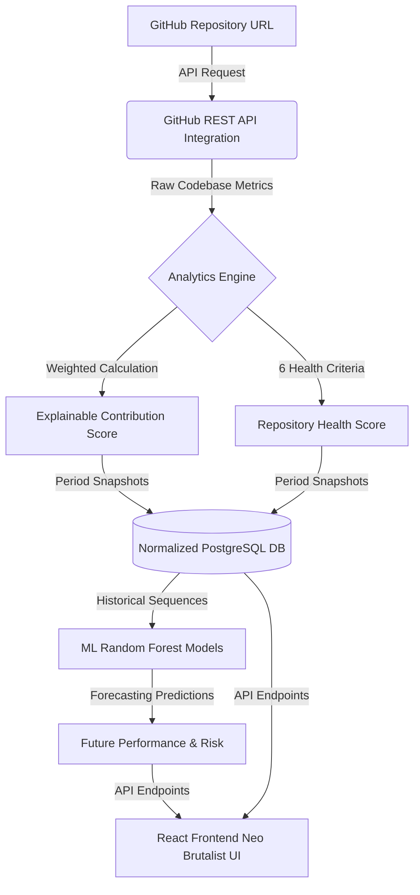
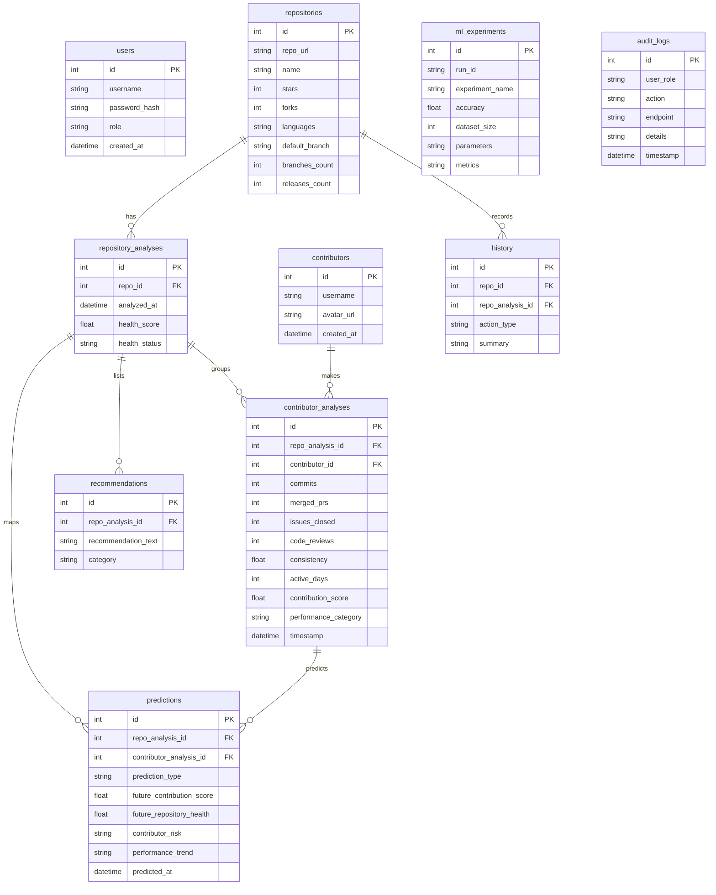

# RepoIntel - AI-Powered Engineering Intelligence Platform

RepoIntel is a commercial-grade Repository Analytics and Contributor Intelligence SaaS platform. It combines transparent scoring indicators, predictive machine learning pipelines (forecasting scores, performance trends, and collaborator risk alerts), and robust MLOps tracking (using MLflow registry, Evidently AI drift reports, and automated retraining pipelines) packaged inside a handcrafted Neo Brutalist UI.

---

## 1. System Architecture

The following diagram illustrates the hybrid data flow architecture of RepoIntel:



---

## 2. Database Schema (ER Diagram)

The PostgreSQL database enforces a normalized entity schema to log runs, tracks, metrics, and logs:



---

## 3. Production APIs

RepoIntel exposes robust FastAPI REST endpoints:

### Authentication
* **`POST /auth/register`**: Registers a new user account specifying roles (`Admin`, `Team Leader`, `Viewer`).
* **`POST /auth/login`**: Authenticates user credentials and returns a signed JWT token containing sub identity and role.

### Analytics & Heuristics
* **`POST /analyze-repo`**: Main execution endpoint. Fetches real data, computes score & health engines, stores snapshots in DB, runs forecasting algorithms, and writes recommendations. (Admins/Team Leaders only).
* **`POST /team-ranking`**: Returns ranked developer leaderboard sorted by score.
* **`POST /repository-health`**: Returns detailed health score indices.
* **`POST /recommendations`**: Returns heuristic insights list.
* **`POST /top-performer`**: Identifies Elite/Consistent/Active contributors.
* **`POST /risk-analysis`**: Flags low contribution score or reduced activity risks.

### History & Auditing
* **`GET /history`**: Returns list of past repository analysis runs with search, pagination, and sorting metadata.
* **`GET /recent`**: Lists latest 10 executed predictions.
* **`GET /stats`**: Returns overall dashboard KPI statistics.
* **`DELETE /history`**: Wipes all DB tables (Admin role only, audited).
* **`GET /contributors/{username}`**: Returns historical contributor sequence and scoring timelines.
* **`GET /repositories`**: Lists tracked repositories in the database.

### MLOps
* **`GET /drift-detection`**: Triggers Kolmogorov-Smirnov statistical check to track feature drift.
* **`GET /drift-report`**: Returns Evidently AI interactive HTML report.
* **`POST /retrain`**: Evaluates DB records, triggers Random Forest retraining, and registers model metrics in MLflow.

---

## 4. Docker Guide

RepoIntel runs inside a multi-container isolated orchestration network. Everything can be booted in one command:

```bash
# Verify configurations and boot services
docker compose up --build -d
```

### Services Mapped
1. **`db`**: PostgreSQL 15 database listening on port `5432`.
2. **`mlflow`**: MLflow tracking registry server listening on port `5000`.
3. **`backend`**: FastAPI REST backend server listening on port `8000`.
4. **`frontend`**: React static node web app listening on port `3000`.

---

## 5. MLflow & MLOps Guide

RepoIntel maps the full lifecycle of predictive machine learning forecasting:

### Feature Engineering & Modeling
* Evaluates contributors' historical records over 4 periods.
* **Features**: `[commits, merged_prs, issues_closed, code_reviews, active_days, consistency, current_score]`
* **ML Algorithms**: Random Forest Regressors (predict future score/health) and Random Forest Classifiers (predict trend direction and risk levels).

### Experiment Tracking
* Logs metrics (`contrib_score_rmse`, `contrib_trend_accuracy`, `contrib_risk_accuracy`, `repo_health_rmse`) and parameters (`n_estimators`, `max_depth`) in MLflow.
* Logs trained model files (`future_score_model.pkl`, `trend_model.pkl`, `risk_model.pkl`, `future_health_model.pkl`) as Registry artifacts.
* Status metrics are logged in the database (`ml_experiments` table) and visualized in the Admin panel.

### Data Drift
* Evidently AI package maps features changes.
* KS-test fallback executes a 2-sample Kolmogorov-Smirnov test at `alpha = 0.05` across features to flag drift if Evidently dependencies are absent in the local compiler.

---

## 6. GitHub Actions Guide

A CI/CD workflow is set up in `.github/workflows/ci.yml` that automatically:
1. Checks out repository codebase on commit/PR.
2. Installs requirements and runs flake8 Python code syntax check.
3. Initializes the database tables locally and runs python unit tests in `pytest`.
4. Checks node package resolution and compiles Vite production assets.
5. Verifies building integrity of Docker containers.
